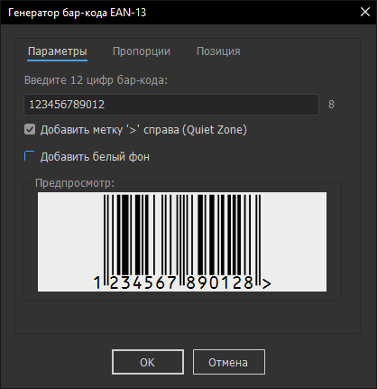
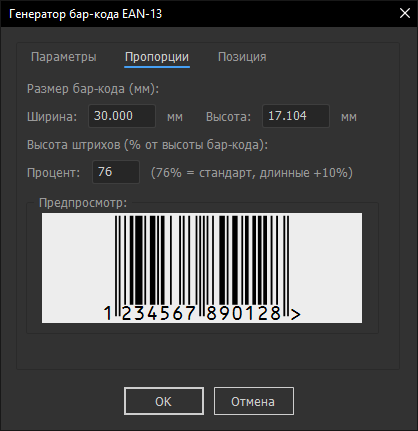
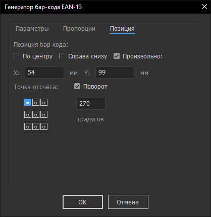

# Генератор бар-кода EAN-13 для Adobe Illustrator

## 📥 Легкий и мощный скрипт (JSX) для создания векторных штрихкодов стандарта EAN-13 прямо внутри Adobe Illustrator.

Больше не нужно использовать сторонние онлайн-генераторы или сомнительные шрифты — создавай корректную векторную геометрию в один клик.

---

## ✨ Основные возможности

- **Автоматизация:** расчет контрольной суммы (13-я цифра) выполняется автоматически.
- **Точная геометрия:** штрихкод строится как набор векторных прямоугольников с учетом стандартов (Guard Bars, Quiet Zone).
- **Гибкие настройки:** Выбор единиц измерения (мм, см, дюймы, пункты, пики, пиксели) в зависимости от настроек документа, настройка высоты штрихов в процентах, Добавление белого фона и маркера «Quiet Zone» (>).
- **Умное позиционирование:** установка кода по центру артборда, в угол или по заданным координатам с выбором точки привязки (Registration Point).
- **Векторный текст:** цифры кода автоматически преобразуются в кривые (используется OCR-B или Arial).

---

## 🛠 Установка

### Автоматическая (Windows)

В релизах есть файл Install.bat.
1. Закройте Adobe Illustrator.
2. Запустите Install.bat от имени Администратора.
3. Выберите язык установки (RU/EN). Скрипт сам найдет путь к папке с пресетами Adobe Illustrator и установит шрифт ocrb10.otf.

### Ручная
### Если Вы используете macOS или хотите установить вручную:

1. Скопируйте файл RU.jsx (или EN.jsx) в папку скриптов Adobe Illustrator:
  **Win:** C:\Program Files\Adobe\Adobe Illustrator [версия]\Presets\[язык]\Scripts
  **macOS:** /Applications/Adobe Illustrator [версия]/Presets/[язык]/Scripts
2. Перезапустите Adobe Illustrator.

---

## 📖 Как использовать
1. Перейдите в меню Файл -> Сценарии -> Bar-code (File -> Scripts -> Bar-code).
2. Введите 12 цифр Вашего кода.
3. Настройте пропорции во второй вкладке и позицию в третьей.
4. Нажмите "OK".

## ⚠️ Требования

- Adobe Illustrator (протестировано на версиях CC).
- Для корректного отображения цифр рекомендуется установить шрифт OCR-B (идет в комплекте в папке Font).

## 🖼️ Скриншоты

